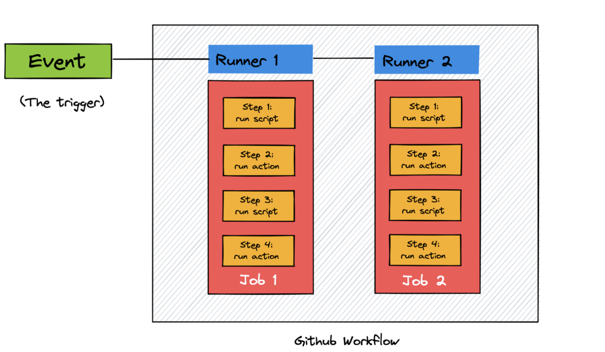

# Github  Features 
## Github actions
https://docs.github.com/en/actions

自动化构建，测试和部署的软件，允许当任何一个事件发生时运行任意的代码；
事件：发生在github仓库上的任意事情，push, create branch, open a pull request, https://docs.github.com/en/actions/learn-github-actions/events-that-trigger-workflows#webhook-events
work flows：当被事件触发时，是一系列由jobs组成的自动化的过程。在根目录.git/workflows 下的yml文件
jobs：一系列需要执行的task，每一步要么是一个脚本要么是github actions；jobs可以并行运行；
Runners：服务器上的一个进程，运行一个workflow，负责执行一个job，也可以self-hosted，https://docs.github.com/en/actions/hosting-your-own-runners

actions：独立的task，在job中调用，用于多次执行复杂任务；如publishing a Python package to PyPi, sending a notification email, setting Python to a specific version before running a script, etc.
	可以构建自己的actions，也可以重用一些开源的actions https://github.com/marketplace?type=actions

### 语法：
https://docs.github.com/en/actions/using-workflows/workflow-syntax-for-github-actions


https://towardsdatascience.com/a-tour-of-10-useful-github-features-d92dde0bf412

